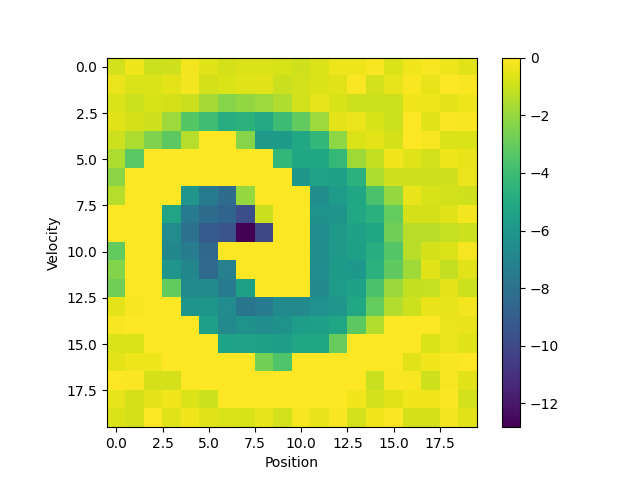
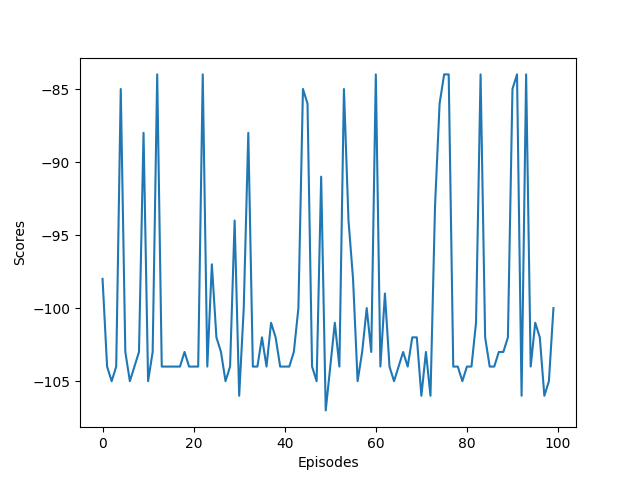

# IRLwPython


Inverse Reinforcement Learning Algorithm implementation with python.

# Implemented Algorithms

## Maximum Entropy IRL: [1]

## Maximum Entropy Deep IRL

# Experiments

## Mountaincar-v0
[gym](https://www.gymlibrary.dev/environments/classic_control/mountain_car/)

The expert demonstrations for the Mountaincar-v0 are the same as used in [lets-do-irl](https://github.com/reinforcement-learning-kr/lets-do-irl/tree/master/mountaincar/maxent).

*Heatmap of Expert demonstrations with 400 states*:

 

### Maximum Entropy Inverse Reinforcement Learning

IRL using Q-Learning with a Maximum Entropy update function.

#### Training

*Learner training for 1000 episodes*:


*Learner training for 4000 episodes*:


#### Heatmaps

*Learner state frequencies after 1000 episodes*:


*Learner state frequencies after 2000 episodes*:


*Learner state frequencies after 5000 episodes*:


*State rewards heatmap after 5000 episodes*:


*State rewards heatmap after 14000 episodes*:


#### Testing

*Testing results of the model after 29000 episodes*:


### Deep Maximum Entropy Inverse Reinforcement Learning

IRL using Deep Q-Learning with a Maximum Entropy update function.

#### Training

*Learner training for 1000 episodes*:


*Learner training for 5000 episodes*:


#### Heatmaps

*Learner state frequencies after 1000 episodes*:


*Learner state frequencies after 2000 episodes*:


*Learner state frequencies after 5000 episodes*:


*State rewards heatmap after 1000 episodes*:


*State rewards heatmap after 2000 episodes*:


*State rewards heatmap after 5000 episodes*:




#### Testing

*Testing results of the best model after 5000 episodes*:



### Deep Maximum Entropy Inverse Reinforcement Learning with Critic

Coming soon...

# References
The implementation of MaxEntropyIRL and MountainCar is based on the implementation of: 
[lets-do-irl](https://github.com/reinforcement-learning-kr/lets-do-irl/tree/master/mountaincar/maxent)

[1] [BD. Ziebart, et al., "Maximum Entropy Inverse Reinforcement Learning", AAAI 2008](https://cdn.aaai.org/AAAI/2008/AAAI08-227.pdf).

# Installation

```commandline
cd IRLwPython
pip install .
```

# Usage

```commandline
usage: irl [-h] [--version] [--training] [--testing] [--render] ALGORITHM

Implementation of IRL algorithms

positional arguments:
  ALGORITHM   Currently supported training algorithm: [max-entropy, max-entropy-deep]

options:
  -h, --help  show this help message and exit
  --version   show program's version number and exit
  --training  Enables training of model.
  --testing   Enables testing of previously created model.
  --render    Enables visualization of mountaincar.
```
