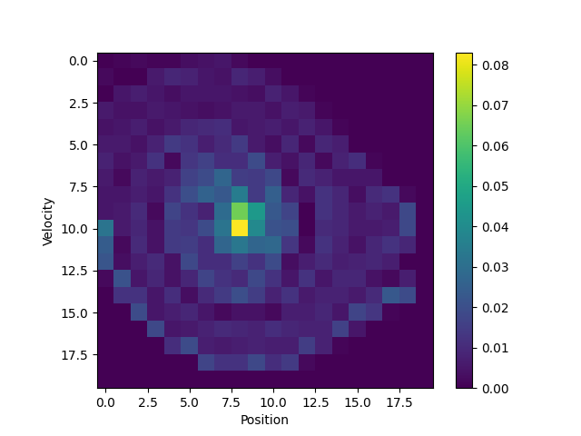

# IRLwPython


Inverse Reinforcement Learning Algorithm implementation with python.

# Exploring Maximum Entropy Inverse Reinforcement Learning

My seminar paper can be found in [paper](https://github.com/HokageM/IRLwPython/tree/main/paper), which is based on
IRLwPython version 0.0.1

# Implemented Algorithms

## Maximum Entropy IRL:

Implementation of the Maximum Entropy inverse reinforcement learning algorithm from [1] and is based on the
implementation
of [lets-do-irl](https://github.com/reinforcement-learning-kr/lets-do-irl/tree/master/mountaincar/maxent).
It is an IRL algorithm using Q-Learning with a Maximum Entropy update function.

## Maximum Entropy IRL (MEIRL):

Implementation of the maximum entropy inverse reinforcement learning algorithm from [1] and is based on the
implementation
of [lets-do-irl](https://github.com/reinforcement-learning-kr/lets-do-irl/tree/master/mountaincar/maxent).
It is an IRL algorithm using q-learning with a maximum entropy update function for the IRL reward estimation.
The next action is selected based on the maximum of the q-values.

## Maximum Entropy Deep IRL (MEDIRL:

An implementation of the maximum entropy inverse reinforcement learning algorithm, which uses a neural-network for the
actor.
The estimated irl-reward is learned similar as in MEIRL.
It is an IRL algorithm using deep q-learning with a maximum entropy update function.
The next action is selected based on an epsilon-greedy algorithm and the maximum of the q-values.

## Maximum Entropy Deep RL (MEDRL):

MEDRL is a RL implementation of the MEDIRL algorithm.
This algorithm gets the real rewards directly from the environment,
instead of estimating IRL rewards.
The NN architecture and action selection is the same as in MEDIRL.

# Experiment

## Mountaincar-v0

The Mountaincar-v0 is used for evaluating the different algorithms.
Therefore, the implementation of the MDP for the Mountaincar
from [gym](https://www.gymlibrary.dev/environments/classic_control/mountain_car/) is used.

The expert demonstrations for the Mountaincar-v0 are the same as used
in [lets-do-irl](https://github.com/reinforcement-learning-kr/lets-do-irl/tree/master/mountaincar/maxent).

*Heatmap of Expert demonstrations with 400 states*:

 

### Comparing the algorithms

The following tables compare the result of training and testing the two IRL algorithms Maximum Entropy and
Maximum Entropy Deep. Furthermore, results for the RL algorithm Maximum Entropy Deep algorithm are shown, to
highlight the differences between IRL and RL.

| Algorithm                | Training Curve after 1000 Episodes                                         | Training Curve after 5000 Episodes                                          |
|--------------------------|----------------------------------------------------------------------------|-----------------------------------------------------------------------------|
| Maximum Entropy IRL      |            |            |
| Maximum Entropy Deep IRL |  |  |
| Maximum Entropy Deep RL  |          |          |

| Algorithm                | State Frequencies Learner: 1000 Episodes                                    | State Frequencies Learner: 2000 Episodes                                     | State Frequencies Learner: 5000 Episodes                                     |
|--------------------------|-----------------------------------------------------------------------------|------------------------------------------------------------------------------|------------------------------------------------------------------------------|
| Maximum Entropy IRL      |                   |                   |                   |
| Maximum Entropy Deep IRL |  |  |  |
| Maximum Entropy Deep RL  |                |                |                |

| Algorithm                | IRL Rewards: 1000 Episodes                                                | IRL Rewards: 2000 Episodes                                                 | IRL Rewards: 5000 Episodes                                                 | IRL Rewards: 14000 Episodes                                |
|--------------------------|---------------------------------------------------------------------------|----------------------------------------------------------------------------|----------------------------------------------------------------------------|------------------------------------------------------------|
| Maximum Entropy IRL      |                   | None                                                                       |                   |  |
| Maximum Entropy Deep IRL |  |  |  | None                                                       |
| Maximum Entropy Deep RL  | None                                                                      | None                                                                       | None                                                                       | None                                                       |

| Algorithm                | Testing Results: 100 Runs                                                               |
|--------------------------|-----------------------------------------------------------------------------------------|
| Maximum Entropy IRL      |                       |
| Maximum Entropy Deep IRL |     |
| Maximum Entropy Deep RL  |  |

# References

The implementation of MaxEntropyIRL and MountainCar is based on the implementation of:
[lets-do-irl](https://github.com/reinforcement-learning-kr/lets-do-irl/tree/master/mountaincar/maxent)

[1] [BD. Ziebart, et al., "Maximum Entropy Inverse Reinforcement Learning", AAAI 2008](https://cdn.aaai.org/AAAI/2008/AAAI08-227.pdf).

# Installation

```commandline
cd IRLwPython
pip install .
```

# Usage

```commandline
usage: irl-runner [-h] [--version] [--training] [--testing] [--render] ALGORITHM

Implementation of IRL algorithms

positional arguments:
  ALGORITHM   Currently supported training algorithm: [max-entropy, max-entropy-deep, max-entropy-deep-rl]

options:
  -h, --help  show this help message and exit
  --version   show program's version number and exit
  --training  Enables training of model.
  --testing   Enables testing of previously created model.
  --render    Enables visualization of mountaincar.
```
